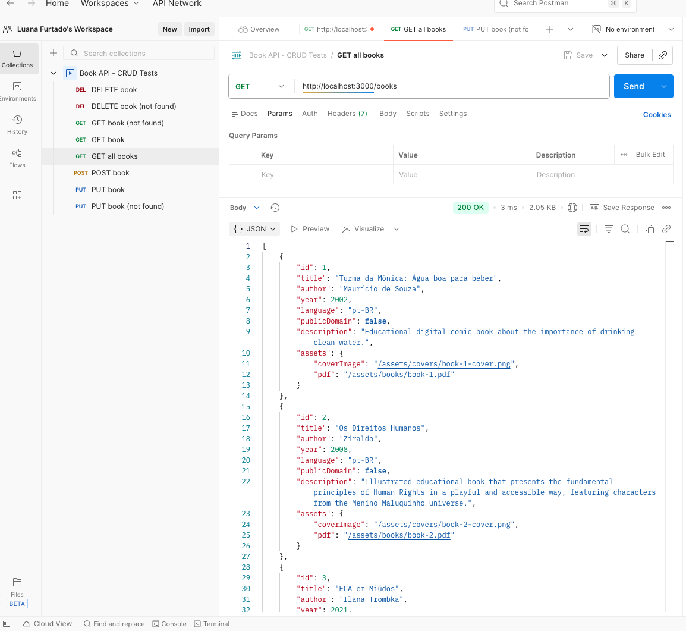
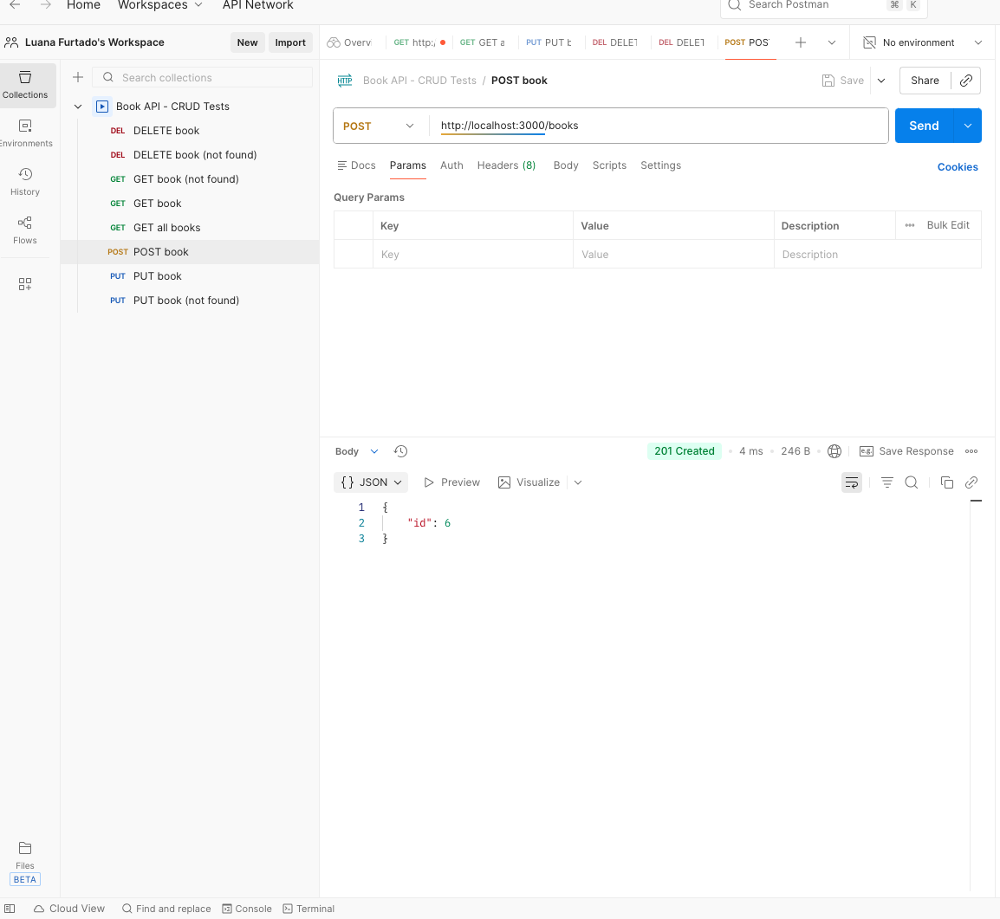
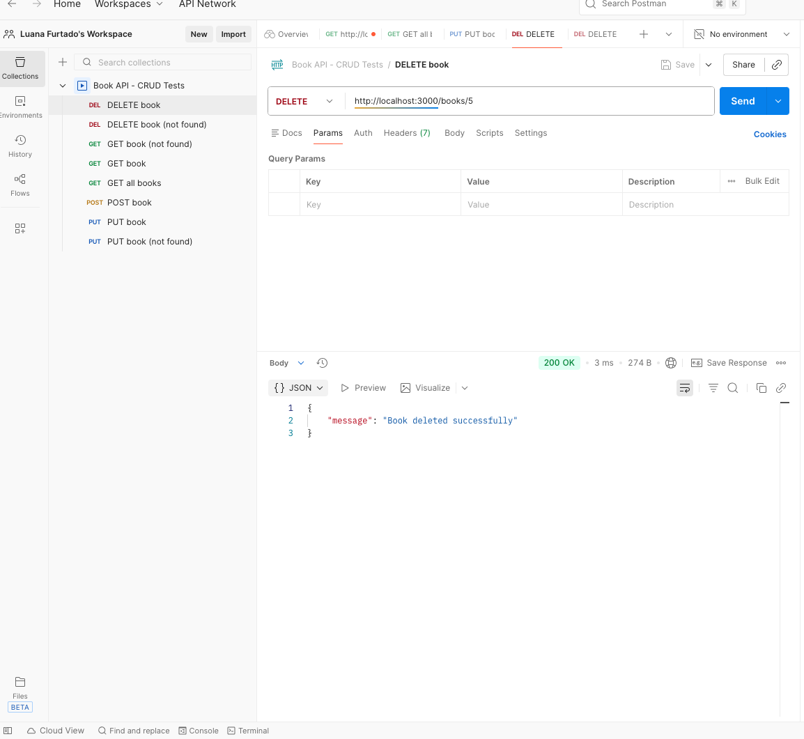

# 📚 Book API

This project is part of the **Techtonica curriculum** and focuses on building a RESTful Book API using **Node.js** and **Express**.

More than a technical exercise, this API was designed with a **personal and family-centered purpose**: to organize reading resources that support **Portuguese literacy**, early reading, and meaningful family connection.

---

## 🌱 Why This Project Exists

I am a Brazilian mother raising my children in a multilingual environment. As my daughter begins to learn how to read in Portuguese, I wanted to create a space that brings together books that are:

- Written in **Portuguese**
- **Easy to read** for early readers
- Emotionally meaningful — including stories that were important in my own childhood
- **Legally licensed for free distribution** (not public domain)

This API exists to transform that intention into a structured, reusable backend resource — combining **technology, language, and family connection**.

---

## 🎯 Project Goals

- Build a REST API using **Node.js** and **Express**
- Practice **RESTful routing** and HTTP request handling
- Organize book data in a clean and scalable structure
- Serve book metadata and download links through API endpoints
- Apply professional **Git workflows** using feature branches and pull requests
- Connect technical learning with a real-life, meaningful use case

---

## 🛠 Tech Stack

- Node.js  
- Express  
- JavaScript  

---

## Endpoints

### GET /books
Retrieve a list of all available books.

### GET /books/:id
Retrieve detailed information about a specific book by id.

### POST /books
Create a new book using JSON data sent in the request body.

### PUT /books/:id
Update an existing book by id using JSON data sent in the request body.

### DELETE /books/:id
Delete a book by id.

---

## Postman Testing

All CRUD endpoints were tested using Postman, including success and error cases.

### GET all books

### POST create book

### PUT update book

### DELETE book

## ✨ Future Improvements

- Add book categories by reading level
- Include author and license metadata
- Expand the collection with more Portuguese-language titles
- Prepare the API for future database integration

---

## 💛 Final Note

This project reflects my belief that technology can be both **practical and deeply human** — supporting learning, identity, and connection across generations.